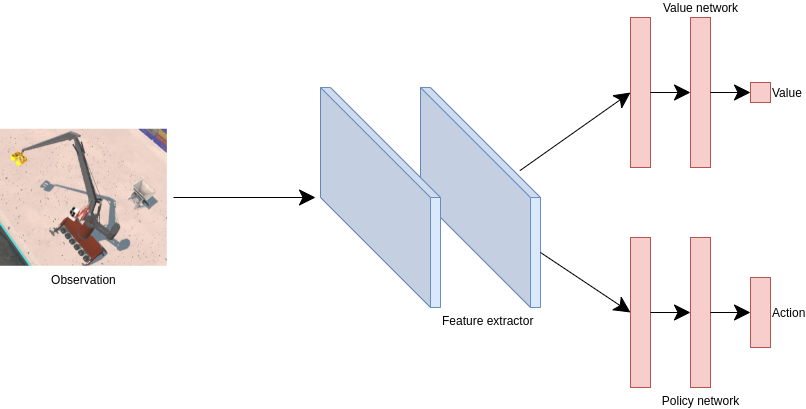
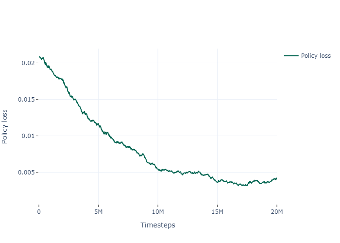
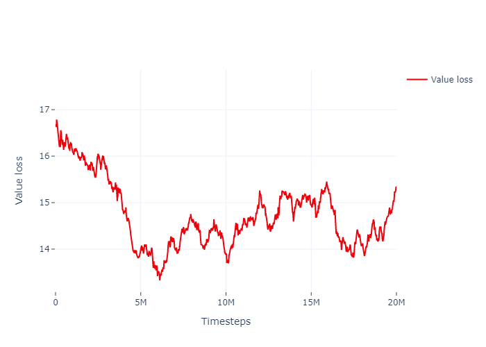

# Smart Mantsinen (work in progress)

## Requirements

1. Python 3.8 or higher
2. Mevea Simulation Software (Modeller and Solver)
3. Mantsinen Model
4. Playback files in .ob format

## Installation

1. Clone the repository:
```bash
git clone https://github.com/mizolotu/SmartMantsinen
```

2. From SmartMantsinen directory, install required python packages (it is obviously recommended to create a new virtualenv and install everything there):
```bash
python -m pip install -r requirements.txt
```

3. Open Mevea Modeller and load Mantsinen Model. Go to Scripting -> Scripts, create a new script object, select ```env_backend.py``` from SmartMantsinen directory as the file name in the object view. Go to I/O -> Inputs -> AI_Machine_Bus_Aux1_RPDO1_u16Y49_BoomLc (or any other input component) and select the object just created as the script name. 

4. In terminal, navigate to the Mevea Software resources directory (default: C:\Program Files (x86)\Mevea\Resources\Python\Bin) and install numpy and requests:
```bash
python -m pip install numpy requests
```

5. Open Mevea Solver, go to Settings, and enable automatic start. Close the solver.

6. Open file ```config.py```, and change path to Mantsinen model. Change other settings if needed.

## Preprocessing (Optional)

1. From SmartMantsinen directory start the server script: 
```
bash python env_server.py
```
2. Replay ```.ob``` file to record the trajectory data into ```.csv```:
```bash
python process_trajectory.py -o <output_file>
```
3. Find minimum and maximum data values for output and reward signals:
```bash
python standardize_data.py
```

## Training

1. From SmartMantsinen directory start the server script, if it has not yet been started: 
```bash
python env_server.py
```

2. Start or continue training the PPO agent:

```bash
python train_ppo.py
```


## Postprocessing

1. Plot reward evolution:
 ```bash
python plot_results.py
```
2. Demonstrate the policy trained:
```bash
python demonstrate_ppo.py -c <first, last or best>
```
The first checkpoint corresponds to the model pretrained with supervised learning.

## Results

  

Model evaluation:
- supervised (behavioral clonning): https://drive.google.com/file/d/12U97PRpldCd-K9r5iUCOpqb3AXWIF9ii/view?usp=sharing
- supervised + reinforcement (transfer learning): https://drive.google.com/file/d/1Nu2yP3NV7r-1gkglhPLMniJfUfGvj8oq/view?usp=sharing


