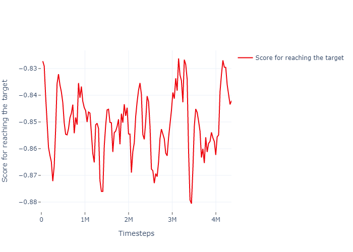
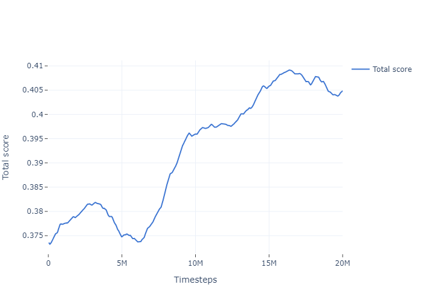

# Smart Mantsinen (work in progress)

## Requirements

1. Python 3.8 or higher
2. Mevea Simulation Software (Modeller and Solver)
3. Mantsinen Model
4. Playback files in .ob format

## Installation

1. Clone the repository:
```bash
git clone https://github.com/mizolotu/SmartMantsinen
```

2. From SmartMantsinen directory, install required python packages (it is obviously recommended to create a new virtualenv and install everything there):
```bash
python -m pip install -r requirements.txt
```

3. Open Mevea Modeller and load Mantsinen Model. Go to Scripting -> Scripts, create a new script object, select ```env_backend.py``` from SmartMantsinen directory as the file name in the object view. Go to I/O -> Inputs -> AI_Machine_Bus_Aux1_RPDO1_u16Y49_BoomLc (or any other input component) and select the object just created as the script name. 

4. In terminal, navigate to the Mevea Software resources directory (default: C:\Program Files (x86)\Mevea\Resources\Python\Bin) and install numpy and requests:
```bash
python -m pip install numpy requests
```

5. Open Mevea Solver, go to Settings, and enable automatic start. Close the solver.

6. Open file ```config.py```, and change path to Mantsinen model. Change other settings if needed.

## Preprocessing

1. From SmartMantsinen directory start the server script: 
```
bash python env_server.py
```
2. Replay ```.ob``` file to record the trajectory data into ```.csv```:
```bash
python process_trajectory.py -o <output_file>
```
3. Find minimum and maximum data values for output and reward signals:
```bash
python standardize_data.py
```

## Training

1. From SmartMantsinen directory start the server script, if it has not yet been started: 
```bash
python env_server.py
```

2. Start or continue training the PPO agent:

```bash
python train_baseline.py -c <path_to_checkpoint_file>
```

## Postprocessing

1. Plot reward evolution:
 ```bash
python plot_reward.py
```
2. Demonstrate the policy trained:
```bash
python demonstrate_baseline.py
```

3. Model checkpoints are created via default callback which runs every few steps, unnecessary checkpoints can be removed as follows (only the checkpoint with the latest date and the checkpoint with tha maximum training steps will remain):

```bash
python clean_checkpoints.py -c <path_to_checkpoint_directory> 
```

## Results

  

Model evaluation:
- after 0 steps (behavioral training): https://drive.google.com/file/d/1ApChpqPnCdD1gv98iIlTxZ9vu00eehPP/view?usp=sharing
- after 10M steps: https://drive.google.com/file/d/1YFqbrUANQPN1o437EsJBH3Q8nir4IvRL/view?usp=sharing
- after 20M steps: https://drive.google.com/file/d/1OrJwJ3Q-uJLsvlTzfPj1l3ttWdvkmRXJ/view?usp=sharing
- after 30M steps: https://drive.google.com/file/d/1B1QjsVcsRmkuhcauAZ12ISj6zP6YDO_k/view?usp=sharing
- after 40M steps: https://drive.google.com/file/d/1uUpJS35FlJjA68r1HwOVOuaR7Zdky3i7/view?usp=sharing
- after 50M steps: https://drive.google.com/file/d/1shE-FWRYEHjva0uswLGYdFPAHOFlOkHv/view?usp=sharing
- after 60M steps: https://drive.google.com/file/d/1dqPUNNsyTwmSd-jxcjujaCaP_KMqdU09/view?usp=sharing


